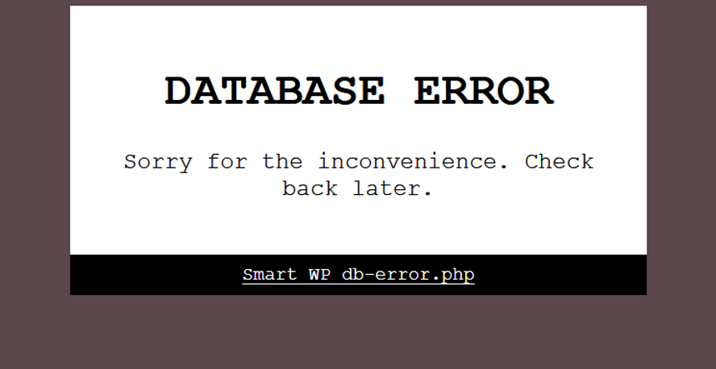

# ITFINDEN WP db-error.php


## RESUMEN

Uno de los problemas más comunes a los que se enfrenta un webmaster de WordPress es la caída ocasional de la conectividad de la base de datos. Dejado a su suerte, WordPress simplemente muestra al usuario final el mensaje


El webmaster no tiene forma de saber que se ha producido un error.

WordPress nos permite abordar este problema de la siguiente manera: si no puede conectarse a su base de datos, ejecutará el plugin drop-in `/wp-content/db-error.php` ([documentacion](https://developer.wordpress.org/reference/functions/dead_db/)) si existe. Smart WP db-error.php utiliza esa funcionalidad incorporada para servir una página 503 informando a los usuarios de la interrupción, al tiempo que envía un correo electrónico a los webmasters para alertarles del problema - pero sólo a intervalos especificados (por defecto: 5 minutos), para no saturar sus servidores de correo y sus buzones.




## Instalacion

Para instalar ITFINDEN WP db-error.php, ejecute lo siguiente:

```sh
cd /path/to/wp-content
git clone https://github.com/agkozak/ITFINDEN-WP-MYSQL-ERROR-TELEGRAM.git
cd ITFINDEN-WP-MYSQL-ERROR-TELEGRAM
cp db-error.php.dist ../db-error.php
cd ..
```

En este punto es vitalmente necesario que edite el nuevo archivo `/wp-content/db-error.php` para incluir la información específica de la instalación. Los valores por defecto son

```php
define( 'MAIL_TO', 'noc@itfinden.com' );
define( 'MAIL_FROM', 'alerta@itfinden.com' );
define( 'ALERT_INTERVAL', 300 );        // In seconds.
define( 'SUPPRESS_CREDITS', false );
```

`MAIL_TO` and `MAIL_FROM` should be addresses chosen to cause the least trouble for spam filters (e-mail sent by PHP from a webserver is likely to need whitelisting). `ALERT_INTERVAL` is the number of seconds between attempts at mailing the webmaster.

## Notas

Si se accede directamente a `/wp-content/db-error.php`, se mostrará la página de error, pero sólo para mostrar al webmaster el aspecto de la página de error. No se enviará ningún correo electrónico. Una metaetiqueta `noindex` recuerda a los motores de búsqueda que nunca deben indexar la página de error (algo improbable de todos modos, ya que la página se sirve con un estado 503).

Si, por el contrario, se accede directamente a `/wp-content/smart-wp-db-error/smart-wp-db-error.php`, las constantes `MAIL_TO`, `MAIL_FROM` y `ALERT_INTERVAL` no habrán sido definidas, y el script `morirá` tranquilamente.


